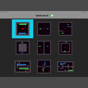
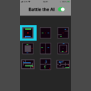
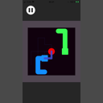
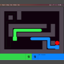
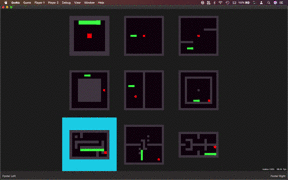
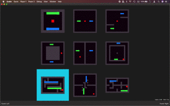

### SwiftSnakeEngine is a snake AI, for iOS and macOS

Hi, I'm Simon Strandgaard and this is my lab, where I experiment with coding a snake AI.

My goal is to make an AI that can play the snake video game at a superhuman level.

See my snake videos:

https://www.youtube.com/playlist?list=PLG29Vi-HcRXGTh8z_o1CQp17j0H7FslbP

Follow me on Twitter:

https://twitter.com/neoneye

# Single player

The AI does a decent job at playing the classic snake video game.

I have created 4 bots that are very good at what they do.

The bots are quick in single player mode, because there is no opponent to consider.
It typically takes less than half a second for a bot to make a move.

# Two players

I'm getting mixed results with 2 bots battling against each other.

It takes between 1 second and 10 seconds for the bots to make their moves.
I want to reduce this time, so that the snake bot can play against itself, 
and it's bearable to watch and debug why the bot made a particular decision.

You can play as a human against the superior AI and feel how it behaves. It's scary!

1. Menu `Player 1`, select `Human - Arrows`.
2. Menu `Player 2`, select `Bot - Monte Carlo 2`.
3. Level selector, select the top-left item and hit the `Enter` key.

# Usage - Level picker

Arrow keys = controls the level picker.

Enter = begin playing.

# Usage - In game

Click with mouse = go back to the level picker.

Arrow keys = controls player1.

WASD keys = controls player2.

"Z" for undo.

Spacebar = pause/resume.

Enter = start over.

ESCape = quit game, useful during development for faster feedback cycle.

# Compiling this project

Xcode 11.4

